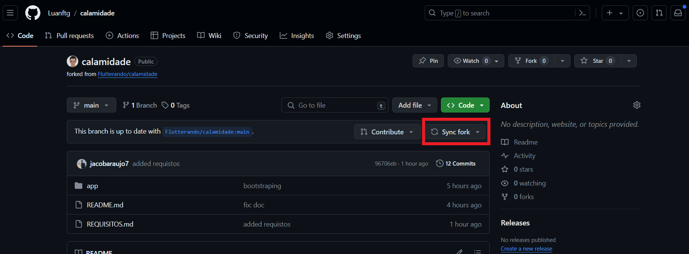

# App Ajuda Enchentes RS

Este aplicativo é uma iniciativa para auxiliar as vítimas das enchentes no Rio Grande do Sul, facilitando a conexão entre voluntários, doadores e as famílias afetadas.

## Personagens

- **Voluntários Adopters**: Indivíduos ou famílias que desejam "adotar" famílias afetadas, fornecendo apoio contínuo.
- **Voluntários de Campo**: Voluntários que trabalham diretamente no terreno para auxiliar os afetados pelas enchentes.

## Funcionalidades

- **Coleta de Informações sobre Doações**: Uma interface para registrar e gerenciar as informações sobre as doações recebidas.
- **Transparência na Destinação de Recursos**: Relatórios e atualizações sobre como os recursos estão sendo usados, garantindo transparência.
- **Recebimento de Donativos**: Sistema para conectar doadores com as necessidades específicas das vítimas.
- **Arrecadação de Fundos**: Ferramenta para facilitar a arrecadação de fundos para apoiar os afetados.
- **QR Code para Doações**: Facilitar doações por meio de um QR code que direciona para uma conta dedicada.

## Liberação de Recursos

As liberações de recursos são feitas parcialmente, acompanhadas de comprovantes e transações financeiras claras para garantir transparência e confiança.

## Contato

- **Coordenadora do Projeto**: Rosane (contato ainda será adicionado)

## Metodologia de Desenvolvimento

- **Dia 1 (Segunda)**: Brainstorm de ideias e requisitos.
- **Dia 2 (Terça)**: Refinamento das ideias e planejamento.
- **Dia 3 (Quarta)**: Produção e desenvolvimento.
- **Dia 4 (Quinta)**: Testes de funcionalidades.
- **Dia 5 (Sexta)**: Revisão final e entrega.

## Tecnologias e Pacotes Utilizados

- [Auto Injector](https://pub.dev/packages/auto_injector): Para injeção de dependências.
- [RouteFly](https://pub.dev/packages/routefly): Gerenciamento de rotas no app.
- [ValueNotifier](https://api.flutter.dev/flutter/foundation/ValueNotifier-class.html): Utilizado para gerenciar estados dentro do app.

## Como Contribuir

Você pode contribuir com o projeto de várias maneiras, incluindo:

- Fazer o fork do repositório do github

- Criar uma branch para a feature que deseja implementar

- Após a implementação, faça um pull request para a branch de desenvolvimento.

### Como executar o projeto

- Certifique-se de que sua versão do dart seja >= 3.3.3

- Certifique-se de que sua versão do flutter seja >= 3.19.5

- Para executar o seu projeto você deve clonar o projeto que você acabou de fazer o fork

```dart
git clone https://github.com/seu_usuario/calamidade.git
```

- Acesse a pasta do projeto

```dart
cd calamidade/app
```

- Instale as dependências

```dart
flutter pub get
```

- Execute o projeto

```dart
flutter run
```

Como fazer o Sync Fork:



## Tutoriais e Recursos

Para ajudar os desenvolvedores a se familiarizarem com as tecnologias e pacotes utilizados neste projeto, compilamos uma lista de vídeos e tutoriais úteis:

- **Flutter com RouteFly**:
  [Assista ao tutorial](https://www.youtube.com/watch?v=DmbIABioAME)
  Este vídeo explica como utilizar o pacote RouteFly para gerenciamento de rotas no Flutter.

- **Flutter ValueNotifier**:
  [Assista à série de vídeos](https://www.youtube.com/watch?v=zV1X9vwYcdI&list=PLlBnICoI-g-eG0eVkHu2IaO48TljxPjPq)
  Esta série de vídeos oferece uma visão detalhada sobre como usar `ValueNotifier` para gerenciar estados no Flutter.

- **Auto Injector no Flutter**:
  [Assista ao tutorial](https://www.youtube.com/watch?v=BwrbAWlKWsQ)
  Aprenda a implementar injeção de dependência no seu projeto Flutter usando o pacote Auto Injector.

Estes recursos são recomendados para todos os membros da equipe, especialmente aqueles novos nas bibliotecas e frameworks utilizados.

## Nomenclatura

- **Diretórios e Arquivos**:
  - **Classes**: PascalCase
  - **Variaveis**: Funções e métodos: camelCase
  - **Interfaces**: Começam com um `I`, por ex. `IRepository`
  - **Implementação**: Termina com `Impl`, por ex. `RepositoryImpl`
  
- **Snake Case**:
  - Use o estilo snake_case para nomes de arquivos.
  - Todas as letras devem ser minúsculas.
  - Palavras separadas por sublinhado.
- **Descrição Concisa**:
  - Mantenha o nome do arquivo descritivo e conciso, refletindo seu conteúdo ou funcionalidade.
  
Toda pagina deve ter seu nome mais o sufixo '`_page.dar`t' para a geração de rotas do routefly.

### Padrão para classes de interface

```dart
//good
abstract interface class IUser {}

//bad
abstract interface class InterfaceUser {}
```

### Padrão para classes de implementação de interface

```dart
//good
class UserImpl implements IUser {}

//bad
class UserImplements implements IUser {}

### Padrão para classes de entity

#### definição: entity vai replicar o que a tela precisa

```dart
//good
class UserEntity {}

//bad
class User {}
```

## State Pattern

- **Flutter State Pattern**:
  [Aprenda State Pattern](https://blog.flutterando.com.br/entendendo-state-pattern-flutter-b0318bab77c3)

```dart
sealed class BasetState {}

class InitialState implements BasetState {}

class LoadingState implements BasetState {}

class SuccessState<R> implements BasetState {
  const SuccessState({
    required this.data,
  });

  final R data;
}

class ErrorState<T> implements BasetState {
  const ErrorState({
    required this.exception,
  });

  final T exception;
}
```

- **Exemplo de uso do State Pattern**

```dart
abstract interface class ILoginController {
  ValueNotifier<DefaultState> get state;

  Future<void> login({
    required String email,
    required String password,
  });
}

class LoginControllerImpl implements ILoginController {
  final IAuthRepository _repository;

  LoginControllerImpl({
    required IAuthRepository repository,
  }) : _repository = repository;

  final _state = ValueNotifier<DefaultState>(InitialState());

  @override
  ValueNotifier<DefaultState> get state => _state;

  @override
  Future<void> login({
    required String email,
    required String password,
  }) async {
    
    _state.value = LoadingState();

    final credentials = Credentials(
      email: email.trim().toLowerCase(),
      password: password.trim(),
    );

    final result = await _repository.login(credentials);

    result.fold(
      (error) => _state.value = ErrorState(exception: error),
      (success) => _state.value = SuccessState(data: success),
    );
  }
}
```

## Princípio da inversão de dependências (DIP)

- É um dos cinco princípios SOLID da programação orientada a objetos. Ele estabelece que:
  - Módulos de alto nível não devem depender de módulos de baixo nível. Ambos devem depender de abstrações.
  - Abstrações não devem depender de detalhes. Detalhes devem depender de abstrações.

*Em termos mais simples, o DIP sugere que os módulos de alto nível devem depender de abstrações, não de implementações concretas. Isso permite que você escreva código que seja mais flexível e fácil de manter, pois os módulos de alto nível não estão vinculados a detalhes de implementação específicos dos módulos de baixo nível*.

- **Para aplicar o DIP em um projeto, você precisa seguir algumas práticas**:

  - **Definir abstrações claras**: Identifique as interfaces ou classes abstratas que descrevem os comportamentos que os módulos de alto nível precisam. Essas abstrações devem ser independentes de qualquer implementação concreta.
  - **Injetar dependências**: Em vez de instanciar objetos diretamente dentro de outros objetos, injete as dependências por meio de construtores, métodos ou propriedades. Isso permite que as implementações concretas sejam substituídas por outras implementações compatíveis sem alterar o código dos módulos de alto nível.
  - **Seguir o Princípio da Inversão de Controle (IoC)**: No DIP, o controle é invertido para que as implementações concretas dependam das abstrações. Isso é frequentemente alcançado por meio de um contêiner de injeção de dependência que gerencia a criação e resolução de dependências.
  - **Testar unidades isoladas**: Ao usar abstrações e injetar dependências, você pode escrever testes de unidade mais facilmente, substituindo as implementações reais por mocks ou stubs durante os testes.

*Ao seguir essas práticas, você pode criar um código mais flexível, modular e fácil de manter, alinhado com os princípios do DIP*.

```dart
  final IAuthRepository _repository;

  LoginControllerImpl({
    required IAuthRepository repository,
  }) : _repository = repository;
```

### Manipulação de Erros e Resultados

- Ao trabalhar com operações que podem retornar resultados ou erros, podemmos usar o typedef `Output<T>` para representar a saída dessas operações. Este typedef nos permite encapsular tanto o sucesso quanto o fracasso em um único tipo usando `Either`.
  - Definição de um typedef para representar a saída de uma operação, onde o tipo de dado retornado pode ser um sucesso (T) ou um erro `(BaseException)`.
  - Este typedef é parametrizado com um tipo genérico T, que representa o tipo de dado retornado em caso de sucesso.
  - Exemplo de uso: `Output<User>` representa a saída de uma operação que retorna um objeto do tipo User em caso de sucesso, ou uma exceção do tipo `BaseException` em caso de erro.

```dart
typedef Output<T> = Either<BaseException, T>;
```

**Exemplo de uso do `Output`**.

```dart
abstract class IAuthRepository {
  Future<Output<void>> login(Credentials credential);
}
```

## Como criar uma nova feature

As features devem ficar no diretorio app/features usando a arquitetura minicore

- **Arquitetura Minicore**:
  [Minicore Doc](https://github.com/Flutterando/minicore)

A features será dividida em 3 camadas, UI, Interactor, Data.

UI - toda parta visual da feature se trata da tela em si.

Interactor - aqui ficarão as entidades, o Interactor que tem a regra de négocios e a gerenciamento de estados e também as interfaces que a camada data deve implementar.

Data - Implementação dos contratos, e os Adapters que devem retornar entity que seriam as serialização dos dados.

- **App todo minicore**:
  [App usando Minicore de exemplo](https://github.com/EdsonMello-code/todoapp)

## Uso de Adapters

Os adapters recebem um Map e devem retornar entity, podem existir também adapters que recebem uma Entity e retornam outra.

## Como adicionar um package

forma para adicionar packages no app
Os packages devem ficar dentro de core/shared/services/

Criar um diretorio com o nome do package e deve conter um contrato que deve ser usada pelo projeto e sua implementação feita com determinado package, o contrato e a implementação devem ficar no mesmo arquivo.

caso o package adicionado seja compartilhado ele deve ficar no core_module

e também deve ter um contrato e sua implementação.

## Core Module

O core module é uma lib interna que serve para compartilhar o código entre os 2 projetos que temos, o app e o dashboard
ele vai lidar com packages compartilhados os contratos e estados que também serão usados nos dois apps.

## Design system

O design system é uma lib interna que vai ter todos components compartilhados e temas, eles ficarão divididos em diretorios exemplo:
dentro de buttons/ todos nossos tipos de botões, seguindo a mesma lógica para toda criação de components.

### Theme Color

Todas as cores podem ser acessadas usando o código:

```dart
final colors = CoopartilharColors.of(context);
```

## Convenção de Commits

- **Commits**:
  - `feat`, `fix`, `doc`, `etc`.

[Conventianal Commits](https://www.conventionalcommits.org/en/v1.0.0)

## Convenção de nomenclatura para branches

- **prefixos utilizados**:
  - **feat**: adição de código novo
  - **fix**: correção de pré-existente
  - **refact**: mudança de um código pré-existente
  - **release**: alterações no pubspac
  - **doc**: alteração na documentação

**exemplo**: `feat/#10-nova-tela-de-usuario`

obs: esse #10 é uma referencia a issue.

## Code review

**[!WARNING]**

- `Atenção`: Somente será feito o merge de MRs revisados por múltiplas pessoas. Esse controle será feito através da verificação do número de reações ao MR que deverá ter ao menos dois.

- *Todo código deverá passar por Code Review através da feature "Pull Request (PR)" do Gitlab durante o processo de merge da branch de "feature" para a branch alvo.
É recomendado que durante o desenvolvimento da feature seja criado um Pull Request de WIP (trabalho em progresso) para permitir coletar feedbacks ao longo do processo. Isso ocorre quando o título da PR é prefixado de WIP:*.

## Acesse nossa comunidade no discord

Entrar no servidor do [Discord](https://discord.gg/BMKxRGnEmT) para discutir ideias e colaborar com outros membros da equipe.

## Licença

Este projeto é distribuído sob a Licença MIT, o que permite o uso, cópia, modificação, fusão, publicação, distribuição, sublicenciação, e/ou venda de cópias do software, desde que as cópias do software sejam acompanhadas pelo aviso de direitos autorais e este aviso de permissão.
